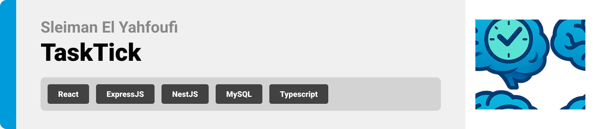
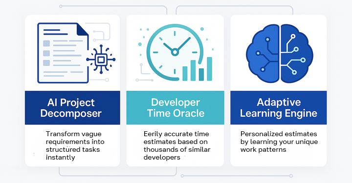

  

<!-- project overview -->

## TaskTick: Smart Development Estimation Tool

TaskTick is an AI-powered task management system designed  for software developers. The platform uses artificial intelligence to decompose projects into granular tasks, provide accurate time estimates based on industry data, and adapt to individual developer workflows over time.

  

<!-- System Design -->

### ER Diagram

### User Flow Diagram

  

### System Flow Diagram

  

### Component Diagram

  

### Sequence Diagram

  
<!-- Project Highlights -->

 

  

<!-- Demo -->

### User Screens (Web)

| Landing                                 | Login                       |
| --------------------------------------- | ------------------------------------- |
|  |  |

| Register                            | Onboarding                       |
| --------------------------------------- | ------------------------------------- |
|  |  |

| Dashboard                            | Projects                       |
| --------------------------------------- | ------------------------------------- |
|  |  |

| Add Project                            | Generated Tasks                       |
| --------------------------------------- | ------------------------------------- |
|  |  |

| Project Details                         |   Tasks                         |   
| --------------------------------------- | --------------------------------------- |
|  |  | 

|   Settings                         |
| ------------------------------------|
|  | 

  

<!-- Development & Testing -->

### Add Title Here

 Validation                            | Testing                        |
 ------------------------------------- | ------------------------------------- |
  |  |

| Services                                |
| --------------------------------------- |
|    |
  

  

<!-- Deployment -->

### Add Title Here

- Description here.

| Prompts                                  | Langchain                             |
| ---------------------------------------  | ------------------------------------- |
|     | |

| Prompt Protection                     |
| ------------------------------------- |
| |

  

<!-- Deployment -->

### Add Title Here

- Description here.

| Postman API 1                            | Postman API 2                       | Postman API 3                        |
| --------------------------------------- | ------------------------------------- | ------------------------------------- |
|  |  |  |

  
