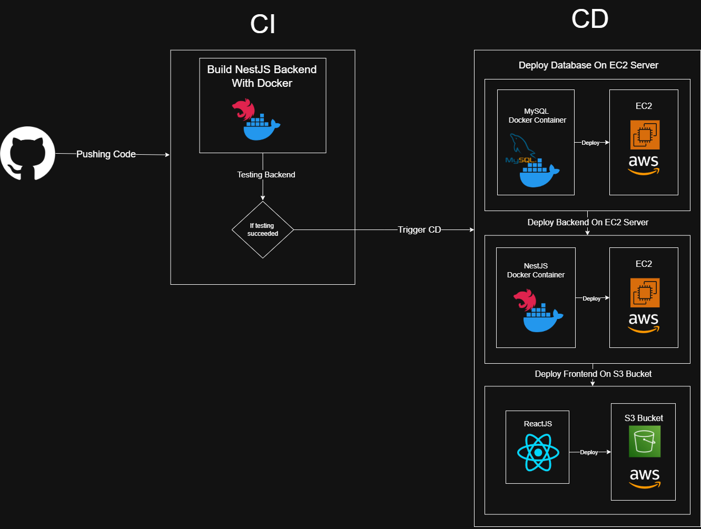
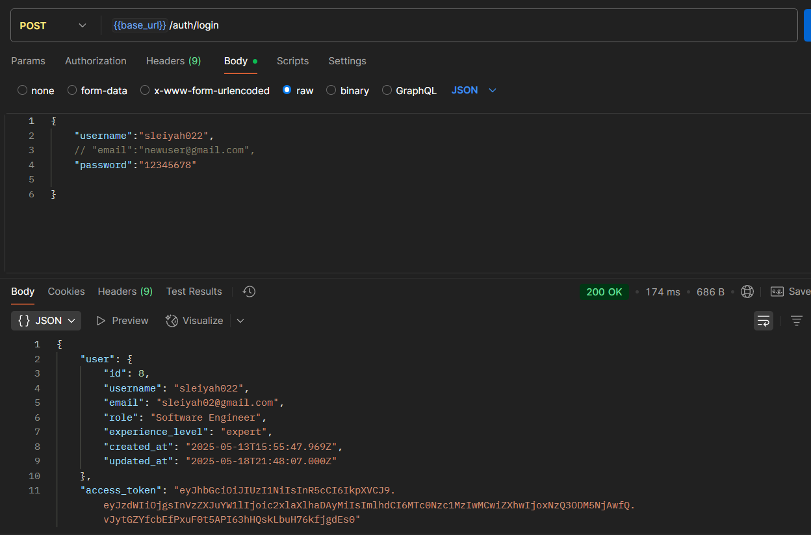
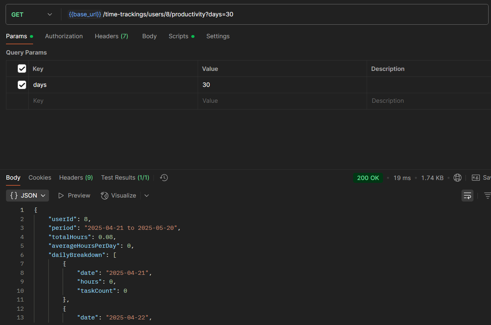

  

<!-- project overview -->

## TaskTick: Smart Development Estimation Tool

TaskTick is an AI-powered task management system designed  for software developers. The platform uses artificial intelligence to decompose projects into granular tasks, provide accurate time estimates based on industry data, and adapt to individual developer workflows over time.

  

<!-- System Design -->

### ER Diagram

### User Flow Diagram

  

### System Flow Diagram

  

### Component Diagram

  

### Sequence Diagram

  
<!-- Project Highlights -->

 

  

<!-- Demo -->

### User Screens (Web)

|   Landing                         |
| ------------------------------------|
|  | 

| Login                                 | Register                       |
| --------------------------------------- | ------------------------------------- |
|  |  |

| Onboarding                            | Dashboard                       |
| --------------------------------------- | ------------------------------------- |
|  |  |

| Projects                            | Add Project                       |
| --------------------------------------- | ------------------------------------- |
|  |  |

| Generated Task                            | Project Details                       |
| --------------------------------------- | ------------------------------------- |
|  |  |

| Tasks                         |   Settings                         |   
| --------------------------------------- | --------------------------------------- |
|  |  | 

### Admin Screen (Web)

|   Analytics                         |
| ------------------------------------|
|  | 
  

<!-- Development & Testing -->

### Validation
 DTO validation with class-validator decorators ensuring data integrity
### Time Tracking Service
 Automatic session duration calculation with heartbeat monitoring
### Comprehensive Test Coverage
 Thorough testing suite with coverage for all service methods

  <table>
    <tr>
      <td><strong>Validation</strong></td>
      <td><strong>Testing</strong></td>
    </tr>
    <tr>
      <td></td>
      <td></td>
    </tr>
  </table>

| Services                                |
| --------------------------------------- |
|    |
  

  

<!-- Deployment -->

### AI Prompt Templates
- System instructions for task generation with time estimates and priority-based due dates
### Langchain Integration
- Zod schema validation and OpenAI model initialization
### Prompt Injection Protection
- Detection system for suspicious input patterns to maintain AI system security

  <table>
    <tr>
      <td><strong>Prompts</strong></td>
      <td><strong>Langchain</strong></td>
    </tr>
    <tr>
      <td></td>
      <td></td>
    </tr>
  </table>

| Prompt Protection                     |
| ------------------------------------- |
| |

  

<!-- Deployment -->

### Deployment Flow

 

### AWS Cloud Deployment:
TaskTick is deployed using AWS infrastructure with an EC2 instance running the NestJS backend and MySQL database. The frontend is served from S3 buckets for improved performance and reliability. The deployment leverages load balancing for traffic management and auto-scaling to handle demand fluctuations, while CloudWatch monitors system health and performance metrics.
| Login                                   |     Project Decomposition                        | 
| --------------------------------------- | ------------------------------------- | 
|  |  | 

|Get Time Trackings                        |
|------------------------------------- |
| |
  
